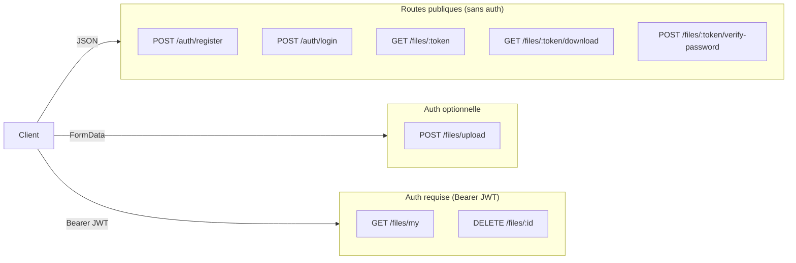
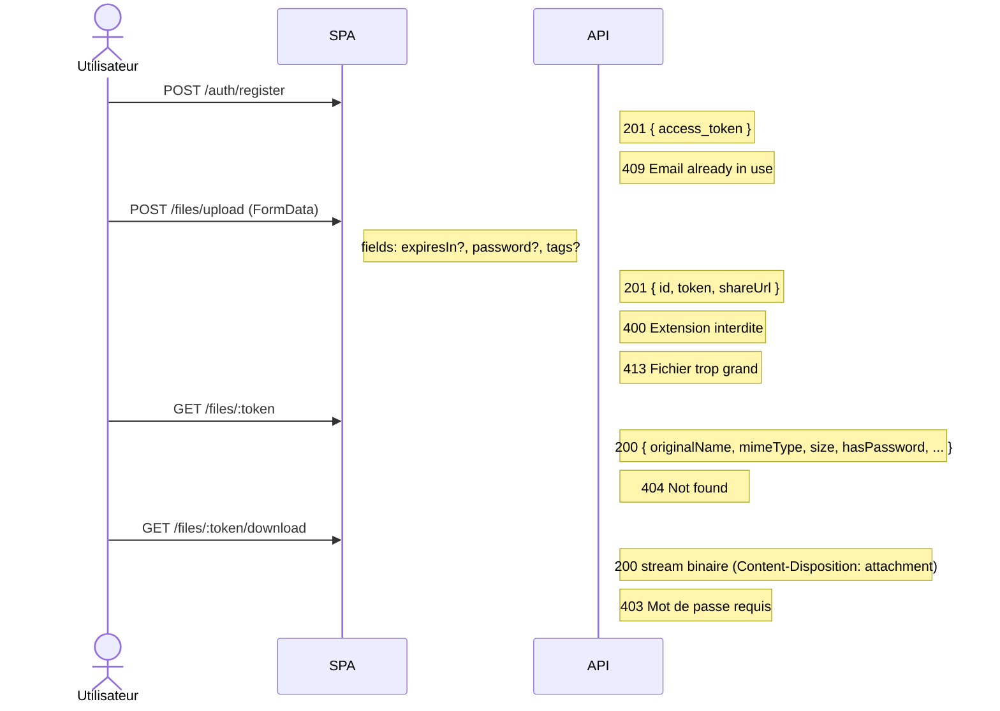
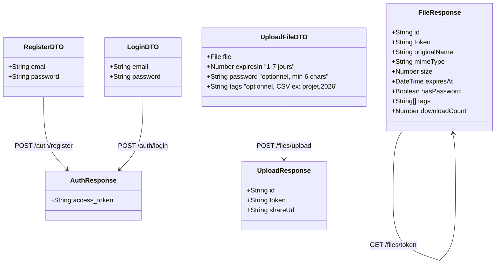

# Contrat d'interface — API DataShare

> Ce fichier contient les diagrammes Mermaid du contrat d'interface frontend/backend.
>
> **Rendu automatique sur GitHub.**
> **Pour draw.io** : ouvrir draw.io → Extras → Edit Diagram → sélectionner "Mermaid" → coller le code.

---

## Vue d'ensemble des endpoints

---

## Séquence : Inscription + Upload + Téléchargement

---

## Format des corps de requête / réponse

---

## Codes d'erreur

| Code | Route(s) | Cause |
|---|---|---|
| 400 | `/files/upload` | Extension interdite ou validation DTO |
| 401 | `/auth/login` | Email/mot de passe incorrect |
| 403 | `/files/:id (DELETE)` | Tentative de suppression d'un fichier d'autrui |
| 403 | `/files/:token/download` | Fichier protégé, vérification requise |
| 404 | `/files/:token` | Token inconnu ou fichier expiré |
| 409 | `/auth/register` | Email déjà utilisé |
| 413 | `/files/upload` | Fichier > MAX_FILE_SIZE (1 Go) |
