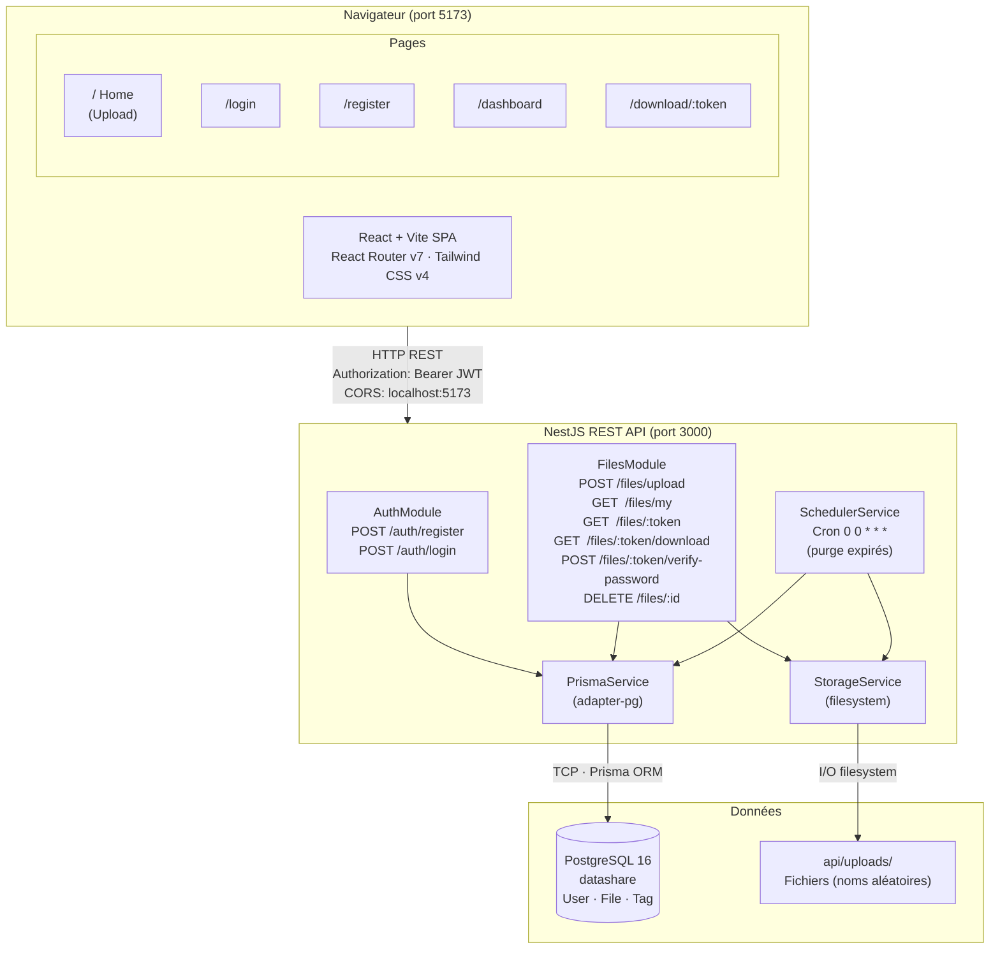
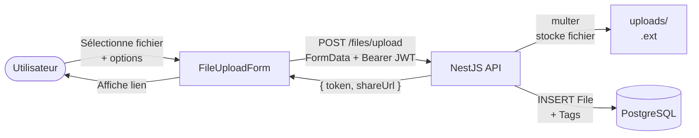
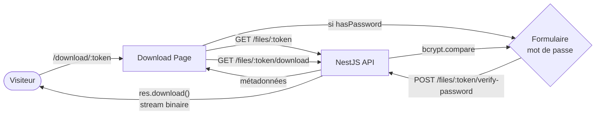
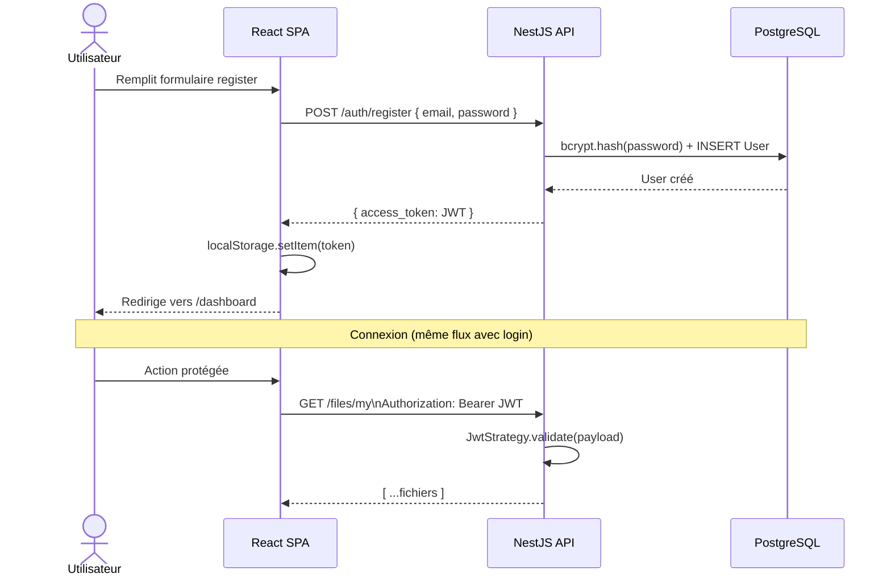

# Schéma d'architecture — DataShare

> Ce fichier contient le code Mermaid du schéma d'architecture.
>
> **Rendu automatique sur GitHub.**
> **Pour draw.io** : ouvrir draw.io → Extras → Edit Diagram → sélectionner "Mermaid" → coller le code.

---

## Architecture globale

---

## Flux d'upload

---

## Flux de téléchargement

---

## Flux d'authentification

