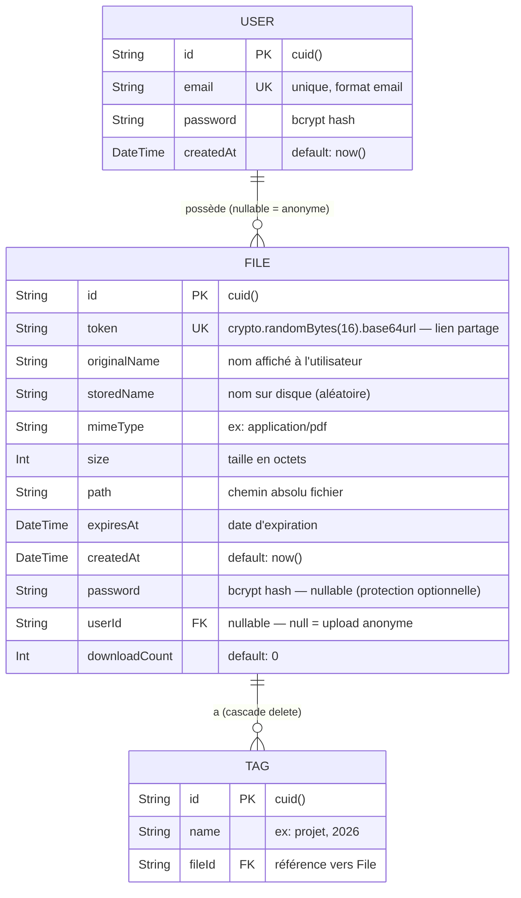

# MCD — Modèle Conceptuel de Données — DataShare

> Ce fichier contient le code Mermaid du MCD (diagramme entité-relation).
>
> **Rendu automatique sur GitHub.**
> **Pour draw.io** : ouvrir draw.io → Extras → Edit Diagram → sélectionner "Mermaid" → coller le code.

---

## Diagramme Entité-Relation

---

## Contraintes et règles métier

| Contrainte | Détail |
|---|---|
| `User.email` | Unique — empêche la double inscription |
| `File.token` | Unique — garantit l'unicité du lien de partage |
| `File.userId` | Nullable — `null` = upload anonyme (US07) |
| `File.password` | Nullable — `null` = pas de protection |
| `Tag(name, fileId)` | Unique composé — pas de tag dupliqué sur un même fichier |
| `onDelete: Cascade` | Supprimer un File supprime tous ses Tags |

---

## Cardinalités

| Relation | Cardinalité | Signification |
|---|---|---|
| User → File | 1 à N (optionnel) | Un utilisateur peut avoir 0 ou plusieurs fichiers |
| File → Tag | 1 à N (optionnel) | Un fichier peut avoir 0 ou plusieurs tags |
| File → User | N à 1 (nullable) | Un fichier appartient à 0 ou 1 utilisateur |
| Tag → File | N à 1 (requis) | Un tag appartient à exactement 1 fichier |
